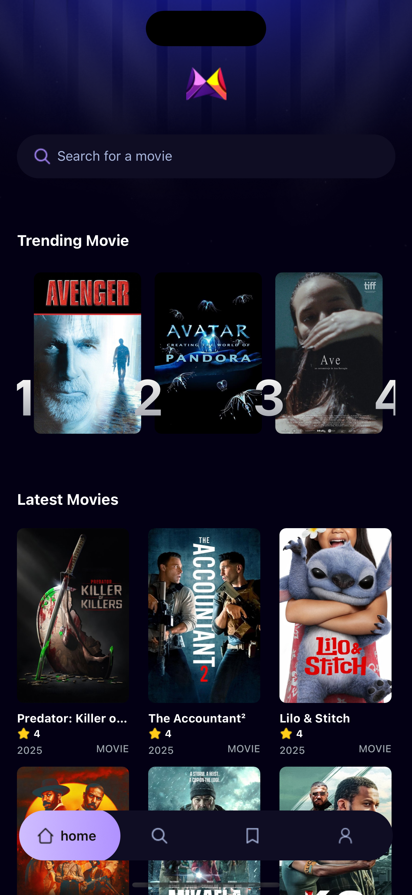

# 🎬 Movies App (React Native + Appwrite)

A cross-platform mobile app built with **React Native**, **TypeScript**, and **Expo**, inspired by a project from **JS Mastery**. This app displays trending and latest movies using the **TMDB API** and allows users to track trending movies by storing selected data using **Appwrite** as the backend.

---

## 📱 Features

- 🔥 View **Trending Movies**
- 🆕 Browse **Latest Releases**
- 📄 Detailed **Movie Info**: posters, descriptions, release dates, ratings
- ⭐ Track trending movies by saving selected ones to the database
- 🧭 Smooth navigation and clean UI

---

## 🛠 Tech Stack

- **React Native** (with Expo)
- **TypeScript**
- **TMDB API** (The Movie Database)
- **Appwrite** (for backend database)
- **React Navigation**

---

## 📸 Screenshots

| Home Screen | Movie Details |
|-------------|----------------|
|  |  |


---

## 🚀 Getting Started

### Prerequisites

- Node.js
- Expo CLI:  
  ```bash
  npm install -g expo-cli
